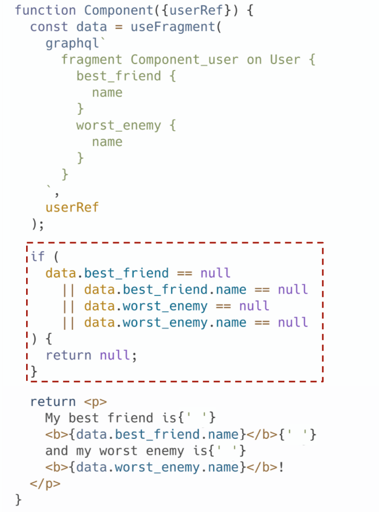

We're extremely excited to release a preview of the new, Rust-based Relay compiler to open source today (as [`v13.0.0-rc.1`](https://github.com/facebook/relay/releases/tag/v13.0.0-rc.1))! This new compiler is faster, supports new runtime features, and provides a strong foundation for additional growth in the future.

Leading up to this release, Meta's codebase had been growing without signs of stopping. At our scale, the time it took to compile all of the queries in our codebase was increasing at the direct expense of developer productivity. Though we tried a number of strategies to optimize our JavaScript-based compiler (discussed below), our ability to incrementally eke out performance gains could not keep up with the growth in the number of queries in our codebase.

So, we decided to rewrite the compiler in Rust. We chose Rust because it is fast, memory-safe, and makes it easy to safely share large data structures across threads. Development began in early 2020, and the compiler shipped internally at the end of that year. The rollout was smooth, with no interruptions to application development. Initial internal benchmarks indicated that the compiler performed nearly 5x better on average, and nearly 7x better at P95. We've further improved the performance of the compiler since then.

This post will explore why Relay has a compiler, what we hope to unlock with the new compiler, its new features, and why we chose to use the Rust language. If you're in a hurry to get started using the new compiler, check out [the compiler package README](https://github.com/facebook/relay/tree/main/packages/relay-compiler) or the [release notes](https://github.com/facebook/relay/releases/tag/v13.0.0-rc.1) instead!

## Why does Relay have a compiler?

Relay has a compiler in order to provide stability guarantees and achieve great runtime performance.

To understand why, consider the workflow of using the framework. With Relay, developers use a declarative language called GraphQL to specify what data each component needs, but not how to get it. The compiler then stitches these components' data dependencies into queries that fetch all of the data for a given page and precomputes artifacts that give Relay applications such a high level of performance and stability.

In this workflow, the compiler

* allows components to be reasoned about in isolation, making large classes of bugs impossible, and
* shifts as much work as possible to build time, significantly improving the runtime performance of applications that use Relay.

Let's interrogate each of these in turn.

### Supporting local reasoning

With Relay, a component specifies only its own data requirements through the use of GraphQL fragments. The compiler then stitches these components data dependencies into queries that fetch all of the data for a given page. Developers can focus on writing a component without worrying how its data dependencies fit into a larger query.

However, Relay takes this local reasoning a step further. The compiler also generates files that are used by the Relay runtime to read out just the data selected by a given component's fragment (we call this [data masking](https://relay.dev/docs/principles-and-architecture/thinking-in-relay/#data-masking)). So a component never accesses (in practice, not just at the type level!) any data that it didn't explicitly request.

Thus, modifying one component's data dependencies cannot affect the data another component sees, meaning that **developers can reason about components in isolation.** This gives Relay apps an unparalleled level of stability and makes large classes of bugs impossible, and is a key part of why Relay can scale to many developers touching the same codebase.

### Improved runtime performance

Relay also makes use of the compiler to shift as much work as possible to build time, improving the performance of Relay apps.

Because the Relay compiler has global knowledge of all components' data dependencies, it is able to write queries that are as good — and generally even better — than they would be if they had been written by hand. It's able to do this by optimizing queries in ways that would be impractically slow at runtime. For example, it prunes branches that can never be accessed from the generated queries and flattens identical sections of queries.

And because these queries are generated at build time, Relay applications never generate abstract syntax trees (ASTs) from GraphQL fragments, manipulate those ASTs, or generate query text at runtime. Instead, the Relay compiler replaces an application's GraphQL fragments with precomputed, optimized instructions (as plain ol' Javascript data structures) that describe how to write network data to the store and read it back out.

An added benefit of this arrangement is that a Relay application bundle includes neither the schema nor — when using persisted queries — the string representation of the GraphQL fragments. This helps to reduce application size, saving users' bandwidth and improving application performance.

In fact, the new compiler goes further and saves users' bandwidth in another way — Relay can inform an application's server about each query text at build time and generate a unique query ID, meaning that the application never needs to send the potentially very long query string over users' slow networks. When using such persisted queries, the only things that must be sent over the wire to make a network request are the query ID and the query variables!

## What does the new compiler enable?

Compiled languages are sometimes perceived as introducing friction and slowing developers down when compared to dynamic languages. However, Relay takes advantage of the compiler to reduce friction and make common developer tasks easier. For example, Relay exposes high-level primitives for common interactions that are easy to get subtly wrong, such as pagination and refetching a query with new variables.

What these interactions have in common is that they require generating a new query from an old one, and thus involve boilerplate and duplication — an ideal target for automation. Relay takes advantage of the compiler's global knowledge to empower developers to enable pagination and refetching by adding one directive and changing one function call. That's it.

**But giving developers the ability to easily add pagination is just the tip of the iceberg.** Our vision for the compiler is that it provides even more high-level tools for shipping features and avoiding boilerplate, gives developers real-time assistance and insights, and is made up of parts that can be used by other tools for working with GraphQL.

A primary goal of this project was that the rewritten compiler's architecture should set us up to achieve this vision over the coming years.

And while we're not there yet, we have made significant achievements on each of the criteria.

For example, the new compiler ships with support for the new `@required` directive, which will nullify the parent linked field or throw an error if a given subfield is null when read out. This may sound like a trivial quality-of-life improvement, but if half of your component's code is null checks, `@required` starts to look pretty good!

> A component without `@required`:
>
> 
>
> And with `@required`:
>
> 

Next, the compiler powers an internal-only VSCode extension that autocompletes field names when you type and shows type information on hover, among many other features. We haven't made it public, yet, but we hope to at some point! Our experience is that this VSCode extension makes working with GraphQL data much easier and more intuitive.

Lastly, the new compiler was written as a series of independent modules that can be reused by other GraphQL tools. We call this the Relay compiler platform. Internally, these modules are being reused for other code generation tools and for other GraphQL clients for different platforms.

## Compiler performance

So far, we've discussed why Relay has a compiler and what we hope the rewrite enables. But we haven't discussed why we decided to rewrite the compiler in 2020: performance.

Prior to the decision to rewrite the compiler, the time it took to compile all of the queries in our codebase was gradually, but unrelentingly, slowing as our codebase grew. Our ability to eke out performance gains could not keep up with the growth in the number of queries in our codebase, and we saw no incremental way out of this predicament.

### Reaching the end of JavaScript

The previous compiler was written in JavaScript. This was a natural choice of language for several reasons: it was the language with which our team had the most experience, the language in which the Relay runtime was written (allowing us to share code between the compiler and runtime), and the language in which the GraphQL reference implementation and our mobile GraphQL tools were written.

The compiler's performance remained reasonable for quite some time: Node/V8 comes with a heavily-optimized JIT compiler and garbage collector, and can be quite fast if you're careful (we were). But compilation times were growing.

We tried a number of strategies to keep up:

* We had made the compiler incremental. In response to a change, it only recompiled the dependencies that were affected by that change.
* We had identified which transforms were slow (namely, flatten), and made the algorithmic improvements we could (such as adding memoization).
* The official `graphql` npm package's GraphQL schema representation took multiple gigabytes of memory to represent our schema, so we replaced it with a custom fork.
* We made profiler-guided micro-optimizations in our hottest code paths. For example, we stopped using the `...` operator to clone and modify objects, instead preferring to explicitly list out the properties of objects when copying them. This preserved the object's hidden class, and enabled the code to better JIT-optimized.
* We restructured the compiler to shell out to multiple workers, with each worker handling a single schema. Projects with multiple schemas are uncommon outside of Meta, so even with this, most users would have been using a single-threaded compiler.

These optimizations weren't enough to keep pace with the rapid internal adoption of Relay.

The biggest challenge was that NodeJS does not support multithreaded programs with shared memory. The best one can do is to start multiple workers that communicate by passing messages.

This works well in some scenarios. For example, Jest employs this pattern and makes use of all cores when running tests of transforming files. This is a good fit because Jest doesn't need to share much data or memory between processes.

On the other hand, our schema is simply too large to have multiple instances in memory, so there was simply no good way to efficiently parallelize the Relay compiler with more than one thread per schema in JavaScript.

### Deciding on Rust

After we decided to rewrite the compiler, we evaluated many languages to see which would meet the needs of our project. We wanted a language that was fast, memory-safe and supported concurrency — preferably with concurrency bugs caught at build time, not at runtime. At the same time we wanted a language that was well-supported internally. This narrowed it down to a few choices:

* C++ met most of the criteria, but felt difficult to learn. And, the compiler doesn't assist with safety as much as we'd like.
* Java was probably also a decent choice. It can be fast and is multi-core, but provides less low-level control.
* OCaml is a proven choice in the compiler space, but multi-threading is challenging.
* Rust is fast, memory-safe, and supports concurrency. It makes it easy to safely share large data structures across threads. With the general excitement around Rust, some previous experience on our team, and usage by other teams at Facebook, this was our clear top choice.

## Internal rollout

Rust turned out to be a great fit! The team of mostly JavaScript developers found Rust easy to adopt. And, Rust's advanced type system caught many errors at build time, helping us maintain a high velocity.

We began development in early 2020, and rolled out the compiler internally at the end of that year. Initial internal benchmarks indicated that the compiler performed nearly 5x better on average, and nearly 7x better at P95. We've further improved the performance of the compiler since then.

## Release in OSS

Today, we're excited to publish the new version of the compiler, as part of the Relay v13. New compiler features include:

* [The `@required` directive.](https://relay.dev/docs/guides/required-directive/)
* The `@no_inline` directive, which can be used to prevent common fragments from being inlined, resulting in smaller generated files.
* Validation for conflicting GraphQL fields, arguments and directives
* [Support for TypeScript type generation](https://github.com/facebook/relay/pull/3182)
* Support for remote query persisting.

You can find more information about the compiler in the [README](https://github.com/facebook/relay/tree/main/packages/relay-compiler) and in the [release notes](https://github.com/facebook/relay/releases/tag/v13.0.0-rc.1)!

We're continuing to develop features within the compiler, such as giving developers the ability to access derived values on the graph, adding support for a more ergonomic syntax for updating local data, and fully fleshing out our VSCode extension, all of which we hope to release to open source. We're proud of this release, but there's still a lot more to come!

## Thanks

Thank you Joe Savona, Lauren Tan, Jason Bonta and Jordan Eldredge for providing amazing feedback on this blog post. Thank you ch1ffa, robrichard, orta and sync for filing issues related to compiler bugs. Thank you to MaartenStaa for adding TypeScript support. Thank you @andrewingram for pointing out how difficult it is to enable the `@required` directive, which is now enabled by default. There are many others that contributed — this was truly a community effort!
