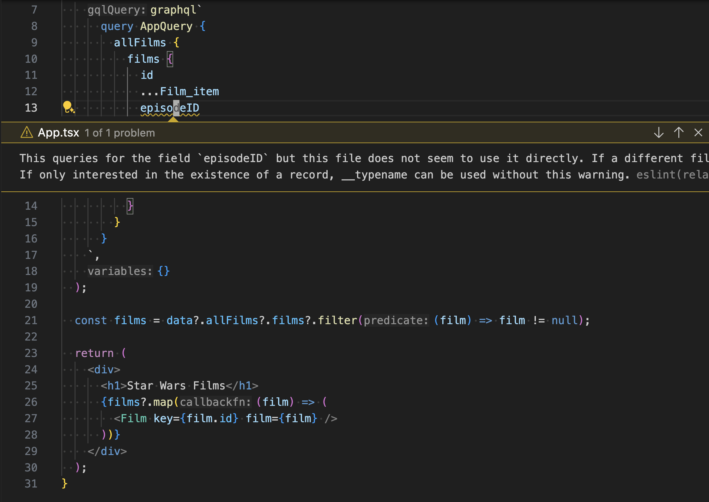

One of the unique features enabled by Relay is the ability to statically detect unused GraphQL fields. This can [categorically prevent](https://relay.dev/blog/2023/10/24/how-relay-enables-optimal-data-fetching/) the "append only query" problem that is a common disfunction in many GraphQL clients.



This validation, and other helpful checks, are enabled by Relay's ESLint plugin [`eslint-plugin-relay`](https://www.npmjs.com/package/eslint-plugin-relay). **The Relay ESLint plugin is a key part of the Relay developer experience**.

## Installation

Assuming you have [ESLint](https://eslint.org/) already installed, you can add the Relay ESLint plugin to your project by running:

```sh
npm install --save-dev eslint-plugin-relay
```

Then update your ESLint configuration to include the plugin:

```js tile="eslint.config.js"
import relay from 'eslint-plugin-relay';

export default [
  // ... other ESlint Config
  {
    plugins: { relay },
    rules: relay.configs['ts-recommended'].rules,
  },
];
```

## Rule Descriptions

The following validation rules are included in the Relay ESLint plugin:

### `relay/unused-fields`
Ensures that every GraphQL field referenced is used within the module that includes it. This helps enable Relay's [optimal data fetching](https://relay.dev/blog/2023/10/24/how-relay-enables-optimal-data-fetching/).

### `relay/no-future-added-value`
Ensures code does not try to explicitly handle the `"%future added value"` enum variant which Relay inserts as a placeholder to ensure you handle the possibility that new enum variants may be added by the server after your application has been deployed.

### `relay/graphql-syntax`
Ensures each `graphql` tagged template literal contains syntactically valid GraphQL. This is also validated by the Relay Compiler, but the ESLint plugin can often provide faster feedback.

### `relay/graphql-naming`
Ensures GraphQL fragments and queries follow Relay's naming conventions. This is also validated by the Relay Compiler, but the ESLint plugin can often provide faster feedback.

### `relay/function-required-argument`
Ensures that `readInlineData` is always passed an explicit argument even though that argument is allowed to be `undefined` at runtime.

### `relay/hook-required-argument`
Ensures that Relay hooks are always passed an explicit argument even though that argument is allowed to be `undefined` at runtime.

### `relay/must-colocate-fragment-spreads`
Ensures that when a fragment spread is added within a module, that module directly imports the module which defines that fragment. This prevents the anti-pattern when one component fetches a fragment that is not used by a direct child component.
**Note**: This rule leans heavily on Meta's globally unique module names. It likely won't work well in other environments.

## Suppressing rules within graphql tags

The following rules support suppression within graphql tags:

- `relay/unused-fields`
- `relay/must-colocate-fragment-spreads`

Supported rules can be suppressed by adding `# eslint-disable-next-line relay/name-of-rule` to the preceding line:

```js
graphql`
  fragment foo on Page {
    # eslint-disable-next-line relay/must-colocate-fragment-spreads
    ...unused1
  }
`;
```

Note that only the `eslint-disable-next-line` form of suppression works. `eslint-disable-line` doesn't currently work until graphql-js provides support for [parsing Comment nodes](https://github.com/graphql/graphql-js/issues/2241) in their AST.

## Contributing

If you wish to contribute to the Relay ESLint plugin, you can find the code on GitHub at [relay/eslint-plugin-relay](https://github.com/relayjs/eslint-plugin-relay/).
